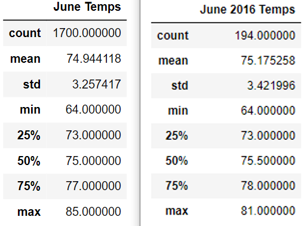
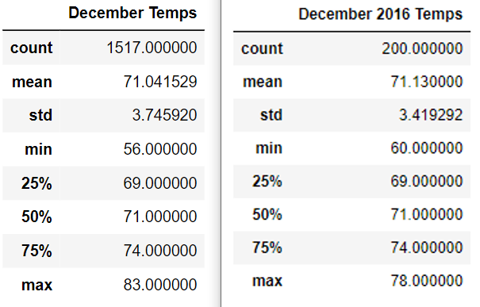

# Surfs_Up Analysis
## Overview of Analysis
### Purpose
In this analysis, statistics for Oahu temperature data for the months of June and December were calculated for a multi-year period. These stats were compared in order to assess sustainability for a prospective business venture.
### Background
Surfing enthusiast W. Avy expressed an interest in opening a surf and ice cream shop in the Oahu area. This analysis provides additional temperature trend information at Mr. Avy's request to help inform possible pending buisness decisions. 

## Results: Key Weather Differences
### Warm Weather
* June on average is warmer than December, with a mean temperature of roughly 75 degrees compared to December's near 71 degrees.
* June has a higher high, reaching a max of 85 degrees compared to December's 81 degrees.
### Cool Weather
* December gets considerably cooler than June, with a low of 56 degrees while June hits its lowest at 64 degrees.

## Summary
### Overall Temp Trends
Although the dateset overall shows June to have higher highs than December and never as low lows, I propose performing additional queries to assess how June and December trend year-to-year. This would help with forward projections as to how these months' temperatures may trend in the future.
### Additional Queries
Below is an example of why additional queries may be beneficial. June's temperature reached its lowest point in 2016. Year-to-year comparisons could reveal whether June is trending colder.

Similarly, December's 2016 max temperature is notably lower than December's max overall.

